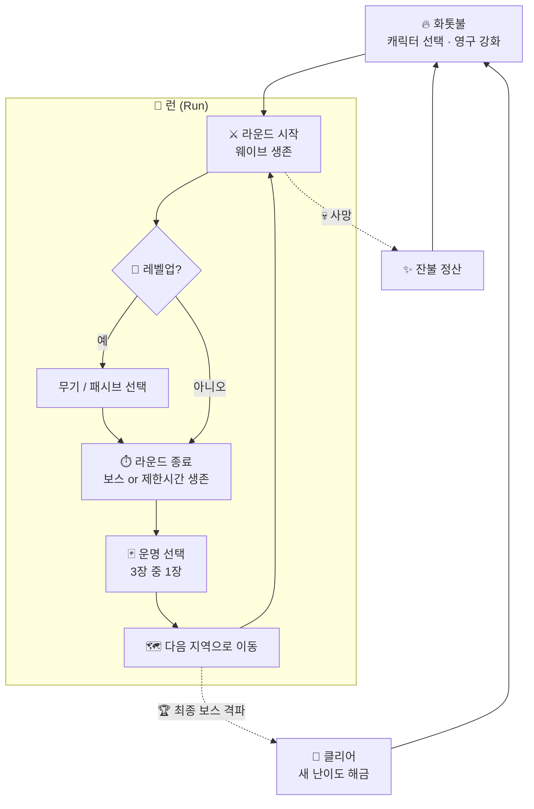

<div align="center">

# 🔥 ASHBORN

### *재에서 다시 태어나는 자*

**죽음은 끝이 아니다. 더 강해져 돌아올 뿐.**

<br/>


<br/>

[🎮 소개](#-소개) •
[📜 세계관](#-세계관) •
[🔁 게임 루프](#-게임-루프) •
[⚙️ 핵심 시스템](#️-핵심-시스템) •
[🗺️ 지역](#️-지역) •
[🛠️ 기술 스택](#️-기술-스택) •
[🧭 로드맵](#-로드맵)

</div>

---

## 🎮 소개

**Ashborn**은 *Vampire Survivors* 스타일의 **탑다운 오토 슈터**에 **로그라이크 라운드 진행**과 **영구 성장(메타 프로그레션)** 을 결합한 2D 액션 게임입니다.

> 몰려오는 적의 물결 속에서 살아남고, 라운드가 끝날 때마다 **운명을 하나 골라** 다음 땅으로 나아가세요.
> 쓰러지면 남은 **잔불(Ember)** 을 모아 화톳불에서 자신을 단련하고, 다시 일어서세요.

<table>
<tr>
<td align="center" width="25%">⚔️<br/><b>자동 전투</b><br/><sub>이동만 하세요.<br/>공격은 알아서.</sub></td>
<td align="center" width="25%">🎲<br/><b>운명 선택</b><br/><sub>라운드마다 3장 중 1장,<br/>매번 다른 빌드.</sub></td>
<td align="center" width="25%">🗺️<br/><b>지역 이동</b><br/><sub>라운드를 넘을수록<br/>더 깊고 위험한 땅으로.</sub></td>
<td align="center" width="25%">🔥<br/><b>죽음 = 성장</b><br/><sub>잔불을 모아<br/>영구적으로 강화.</sub></td>
</tr>
</table>

---

## 📜 세계관

<details open>
<summary><b>프롤로그 펼치기 / 접기</b></summary>

<br/>

> *한때 세상을 밝히던 「태초의 불꽃」이 꺼진 날, 세계는 잿빛으로 물들었다.*
>
> *꺼진 불꽃의 잔해에서 **잿빛 역병(Ash Blight)** 이 피어올랐고, 그것에 삼켜진 생명은 영혼 없는 **재의 무리(Hollow)** 가 되어 남은 빛을 갉아먹기 시작했다.*
>
> *그러나 모든 불씨가 꺼진 것은 아니었다.*
> *마지막 **화톳불(The Hearth)** 곁에서, 재 속에서 몸을 일으키는 자들이 있었다.*
> *죽어도 죽지 않고, 쓰러질 때마다 불꽃을 품고 다시 태어나는 자들.*
>
> *사람들은 그들을 **애쉬본(Ashborn)** 이라 불렀다.*

</details>

### 목표

플레이어는 애쉬본이 되어 역병의 근원인 **「꺼지지 않는 심장」** 까지 나아가 태초의 불꽃을 되살려야 합니다.
한 번에 닿을 수는 없습니다. **죽고, 단련하고, 다시 도전하는 것** 자체가 이 이야기의 일부입니다.

### 주요 용어

| 용어 | 설명 |
|:---|:---|
| 🔥 **화톳불 (The Hearth)** | 런 사이의 거점. 사망 후 귀환하는 곳이며 영구 강화를 진행합니다. |
| ✨ **잔불 (Ember)** | 런 중 획득하는 영구 재화. 죽어도 사라지지 않습니다. |
| 🪙 **골드 · 강화석** | 처치와 보스로 얻는 영구 재화. 장비 강화에 씁니다. |
| 💎 **재의 결정 (Ash Shard)** | 적이 떨어뜨리는 경험치. 해당 런에서만 유효합니다. |
| 🃏 **운명 (Fate)** | 라운드 종료 시 선택하는 랜덤 보상 카드. |
| 👤 **재의 무리 (Hollow)** | 역병에 삼켜진 적 개체들의 총칭. |

---

## 🔁 게임 루프



### 두 개의 성장 축

| 구분 | 🎯 런 내 성장 (휘발성) | 🔥 메타 성장 (영구) |
|:---|:---|:---|
| **재화** | 재의 결정 (경험치) | 잔불 (Ember) |
| **획득** | 적 처치 | 처치 수 · 생존 시간 · 도달 라운드 |
| **사용처** | 레벨업 시 무기·패시브 선택 | 화톳불에서 능력치·해금 구매 |
| **유지** | 사망 시 초기화 | 영구 보존 |

---

## ⚙️ 핵심 시스템

### ⚔️ 전투 (Vampire Survivors 스타일)

- **이동만 직접 조작**하고 공격은 장착한 무기가 쿨다운마다 **자동 발동**합니다.
- 적은 시간이 지날수록 더 많이, 더 강하게 몰려옵니다.
- 적이 떨어뜨린 **재의 결정**을 모아 레벨업하고, 레벨업마다 **무기 또는 패시브 중 1개**를 고릅니다.
- 무기는 최대 레벨 + 짝이 되는 패시브를 가지면 레벨업 때 **각성(Evolution)** 을 고를 수 있습니다. 각성하면 피해 ×1.5에 무기마다 새 효과가 붙습니다.

| 무기 | + 패시브 | 각성 | 효과 |
|:---|:---|:---|:---|
| 불꽃 대검 | 단련된 육체 | **업화의 대검** | 칼날 +2, 궤도 1.3배 |
| 잔불 구체 | 불씨 끌림 | **유성 잔불** | 맞힌 자리에서 터져 주변 적에게 60% 피해 |
| 화염 석궁 | 재바람 | **폭풍 석궁** | 화살 3발 부채꼴, 관통 +3 |

### 🃏 운명 시스템 (라운드 간 랜덤 요소)

지역 보스를 잡으면 무작위 **운명 카드 3장**이 제시되고, 그중 **1장**을 고르면 다음 지역으로 넘어갑니다. 효과는 **그 런이 끝날 때까지** 유지됩니다.

카드는 **스탯 · 스킬 · 보상** 세 종류입니다. 종류 조합은 고정이 아니며, **같은 종류는 최대 2장, 보상은 최대 1장**까지 나옵니다.

**카드 등급**: 카드는 뽑힐 때마다 장비와 같은 **6등급**(노말 · 레어 · 영웅 · 전설 · 에픽 · 고유) 중 하나를 갖습니다.
- 등급이 오를 때마다 나올 확률은 0.4배로 줄고(장비보다 완만), 타락 단계의 등급 운도 똑같이 붙습니다.
- 카드마다 **최소 등급**이 있고, 그 위로 한 등급마다 수치가 **1.4배**가 됩니다. 레벨처럼 정수인 효과는 두 등급마다 +1.
- 뽑은 등급이 그 종류 카드의 최소 등급보다 낮으면 최소 등급으로 올라갑니다 (스킬 카드는 레어부터).
- 카드 한 장이 10% 확률로 **저주**로 나옵니다 (저주가 있는 스탯 · 보상에서만). 저주의 페널티는 고정이고 보상만 등급만큼 커집니다.

| 종류 | 카드 (최소 등급의 수치) |
|:---|:---|
| 📈 **스탯** | 노말: 최대 체력 +20 · 이동 속도 +8% · 피해 +10% · 획득 범위 +40% · 방어력 +15<br/>레어: 공격 속도 +15% · 치명타 확률 +8%<br/>영웅: 생명력 흡수 +3%<br/>전설: 피해 +30% · 최대 체력 +50<br/>저주: 최대 체력 -30 대신 피해 +40% |
| ✨ **스킬** | 레어: 무기 하나 즉시 +2레벨 · 새 무기 획득<br/>영웅: 잿불 폭발 · 서리 갑옷 · 연쇄 번개 (고유 장비와 같은 세기에서 시작)<br/>전설: 한 번 더 부활 (체력 50%) · 광전사의 분노 |
| 🎁 **보상** | 노말: 체력 50% 회복 · 잔불 즉시 획득 · 경험치 획득 +20%<br/>레어: 즉시 2레벨 상승 · 잔불 획득량 +30% · 장비 드랍 확률 +30%<br/>저주: 적 체력 +30% 대신 잔불 +100% · 적 피해 +30% 대신 장비 드랍 +100% |

- 스탯 · 보상 카드와 저주는 **여러 번 고르면 겹칩니다** (저주 배율은 곱해짐). 더 올릴 무기가 없는 무기 카드는 나오지 않습니다.
- 효과 카드는 **이미 가진 효과보다 높은 등급일 때만** 다시 나오고, 고유 장비와 겹치면 센 쪽을 씁니다.
- 불사조의 깃털 부활은 고유 장비 「불사조의 재」와 따로 셉니다.

> 💡 **리롤**: 마음에 드는 카드가 없으면 런마다 **1번** 다시 뽑을 수 있습니다. 리롤 횟수는 메타 성장으로 늘릴 예정입니다.

<details>
<summary><b>운명 카드 카테고리 (기획 초안)</b></summary>

<br/>

- **🗡️ 무기 운명**: 새 무기 획득, 기존 무기 강화 ✅
- **🛡️ 축복 운명**: 런 동안 유지되는 능력치 버프 ✅
- **🌀 변이 운명**: 다음 지역의 규칙을 바꿈 (예: 밤 지역, 적 속도 증가, 엘리트 출현률 증가) ⬜ 미구현
- **💀 저주 운명**: 페널티와 큰 보상을 동시에 부여 ✅
- **🎁 즉발 운명**: 체력 회복, 잔불 즉시 획득, 재의 결정 대량 획득 ✅

</details>

### 🔥 화톳불 (메타 프로그레션)

사망하거나 클리어하면 화톳불(캐릭터 선택 화면)로 돌아와 **잔불**로 영구 강화를 삽니다. 강화는 **모든 캐릭터**에 붙고 기기에 저장됩니다.
게임 오버 화면에서 이번 런에 얻은 잔불 · 골드 · 강화석과 보유 잔불을 정산해 보여 줍니다. 장비 강화는 골드와 강화석으로 합니다.

다음 레벨 비용은 레벨마다 **1.5배**씩 늡니다.

| 분류 | 강화 | 레벨당 | 최대 | 첫 비용 |
|:---|:---|:---|:---:|---:|
| 💪 **기본 능력** | 단단한 몸 | 최대 체력 +10 | 10 | 30 |
| | 불꽃의 힘 | 피해 +5% | 10 | 40 |
| | 가벼운 발 | 이동 속도 +3% | 5 | 40 |
| | 재의 피부 | 방어력 +5 | 10 | 30 |
| | 꺼지지 않는 불씨 | 체력 재생 +0.2/초 | 5 | 50 |
| 🧲 **편의** | 불씨 부름 | 획득 범위 +10% | 5 | 30 |
| | 깨달음 | 경험치 획득 +5% | 10 | 40 |
| | 잔불 수확 | 잔불 획득량 +5% | 10 | 60 |
| 🎲 **운명 조작** | 운명 거스르기 | 다시 뽑기 +1회 | 3 | 200 |
| | 넓어진 시야 | 운명 카드 3 → 4장 | 1 | 1500 |
| | 별의 가호 | 운명 카드 등급 운 +10% | 5 | 150 |

> 🔓 **해금** (새 캐릭터 · 시작 무기 · 새 운명 카드 · 상위 난이도)은 아직 없습니다. 해금할 새 콘텐츠가 생기면 추가합니다.

### 🎒 장비

사냥 중 적이 **무작위로 장비를 떨어뜨립니다** (처치당 2%). 장비는 **영구 보관**되며, 가방(60칸)은 모든 캐릭터가 함께 쓰고 **장착 칸은 캐릭터마다 따로**입니다.
주운 장비는 그 캐릭터의 빈 칸에 바로 장착되고, 아니면 가방에 들어갑니다. 가방이 차면 낄 칸이 없는 장비는 바닥에 남습니다.
장비 화면은 **캐릭터 선택 화면(출정 전)** 과 런 중 HUD의 가방 버튼에서 열 수 있고, 장착 · 교체(능력치 비교 표시) · 강화 · 분해(영웅 이상은 확인 창)를 할 수 있습니다.

| 등급 | 드랍 확률 | 수치 배율 | 랜덤옵션 1칸 확률 (최대 5칸) |
|:---:|---:|---:|---:|
| ⚪ 노말 | 75.0% | ×1.0 | 10% |
| 🔵 레어 | 18.8% | ×1.4 | 25% |
| 🟣 영웅 | 4.7% | ×2.0 | 40% |
| 🟠 전설 | 1.2% | ×2.7 | 55% |
| 🔴 에픽 | 0.29% | ×3.8 | 70% |
| 🟢 고유 | 0.07% | ×5.4 | 85% |

- 등급이 하나 오를 때마다 드랍 확률은 1/4, 수치는 1.4배. 수치는 기준값의 ±20% 안에서 무작위.
- **랜덤옵션에도 등급이 있습니다.** 옵션 등급은 장비 등급과 따로 뽑히지만(낮을수록 흔함), **장비 등급보다 높을 수는 없습니다.** 예: 노말 장비에는 노말 옵션만, 고유 장비에는 노말~고유 옵션.
- 주옵션은 장비와 같은 등급입니다.

| 파츠 | 칸 | 주옵션 (하나가 무작위) |
|:---|:---:|:---|
| 머리 | 1 | 최대 체력 · 에너지 보호막 |
| 장화 | 1 | 이동 속도 · 회피 |
| 양손장비 | 두 손 모두 | 물리/화염/냉기/번개/바람 피해 (한손의 2배) |
| 한손장비 | 손당 1 (최대 2) | 물리/화염/냉기/번개/바람 피해 |
| 장갑 | 1 | 공격 속도 · 치명타 확률 |
| 목걸이 | 1 | 피해 증가 · 치명타 피해 |
| 반지 | 2 | 물리 피해 감소 · 화염/냉기/번개/바람 저항 |
| 허리띠 | 1 | 방어력 · 최대 체력 |
| 귀걸이 | 2 | 획득 범위 · 경험치 획득 · 체력 재생 |

#### 능력치

| 분류 | 능력치 | 동작 |
|:---|:---|:---|
| 생존 | 최대 체력 · 체력 재생 · 생명력 흡수 | 체력이 0이 되면 사망. 흡수는 준 피해의 일부를 회복 |
| 공격 | 물리 · 화염 · 냉기 · 번개 · 바람 피해 | 모든 무기의 매 타격에 고정치로 더해짐 |
| | 피해 증가 · 공격 속도 · 치명타 확률/피해 | 피해 전체에 곱해짐 (치명타 기본 150%) |
| 상태이상 | 출혈 · 화상 · 중독 · 감전 · 동상 확률, 각 피해 | 출혈=물리, 화상=화염, 감전=번개, 동상=냉기 피해가 섞인 타격에만, 중독은 모든 타격 |
| 방어 | 방어력 · 회피 · 에너지 보호막 | 방어력은 물리 피해 감소, 회피는 피격 무효(최대 75%), 보호막은 체력보다 먼저 깎이고 3초간 안 맞으면 재충전 |
| 피해 감소 | 물리 피해 감소 · 화염/냉기/번개/바람 저항 | 해당 속성 피해를 비율로 감소 (최대 75%) |
| 편의 | 이동 속도 · 획득 범위 · 경험치 획득 | |

> 상태이상: 출혈 · 화상은 해당 피해만큼을 3~4초에 나눠 주고(더 센 쪽으로 갱신), 중독은 타격마다 쌓이며, 감전된 적은 피해를 20% 더 받고, 동상에 걸린 적은 30% 느려집니다.
> 적은 지역마다 다른 속성 피해를 줍니다 (아래 지역 표). 해당 속성 저항이 그 피해를 줄입니다.

#### 장비 레벨 · 재화 · 강화

| 항목 | 내용 |
|:---|:---|
| 장비 레벨 | 떨어진 스테이지의 레벨. 고정치 옵션(체력, 속성 피해, 방어력, 보호막, 재생)은 레벨마다 ×1.3. 비율 옵션(%)은 상한이 있어 레벨 영향 없음 |
| 보스 상자 | 보스를 잡으면 레어 이상 장비 3개가 떨어짐 |
| 잔불 획득 | 스테이지 클리어 (20 × 레벨, 타락 보너스), 처치 (0.2 × 레벨, 클리어나 사망 때 정산), 장비 분해 |
| 분해 | 가방의 장비를 잔불로 바꿈. 높은 등급 · 레벨 · 강화일수록 많이 |
| 골드 · 강화석 획득 | 처치마다 골드 1 × 레벨, 3% 확률로 강화석 (타락 보너스). 보스는 골드 50 × 레벨과 강화석 3개 (+타락 단계). 처치분은 클리어나 사망 때 정산 |
| 강화 | **강화석 + 골드**로 +1 ~ **+20**. 단계마다 모든 옵션 +10%. 실패하면 **재료만 사라지고** 단계는 그대로 |

**강화 비용과 확률** (지금 단계 → 다음 단계)

- 강화석: 1 + 지금 단계 (+0 → +1 은 1개, +19 → +20 은 20개)
- 골드: 50 × 1.25^단계 × 1.5^등급 × 장비 레벨 배율
- 성공 확률: +0~+4 100% · +5~+9 90% → 70% · +10~+14 60% → 40% · +15~+19 30% → 10% (단계마다 5%씩 내려감)
- 최대 단계는 `Balance.maxEnhance` 와 확률표를 늘려 올릴 수 있습니다.

#### 고유 효과

고유 등급 장비에는 아래 특수 효과 중 하나가 붙습니다 (같은 효과는 겹치지 않음).

| 효과 | 내용 |
|:---|:---|
| 불사조의 재 | 쓰러지면 런마다 한 번, 체력 50%로 되살아남 |
| 잿불 폭발 | 적 처치 시 25% 확률로 주변에 화염 폭발 |
| 연쇄 번개 | 타격 시 15% 확률로 가까운 적 3명에게 번개 |
| 서리 갑옷 | 피격 시 주변 적 이동 속도 60% 감소 (2초) |
| 광전사의 분노 | 잃은 체력 1%당 피해 1% 증가 |

### 👤 캐릭터 (초안)

| 캐릭터 | 컨셉 | 시작 무기 | 고유 특성 |
|:---|:---|:---|:---|
| 🛡️ **잿불 기사** | 근접 탱커 | 불꽃 대검 (주변 회전 베기) | 받는 피해 감소 |
| 🔮 **재의 마녀** | 원거리 마법사 | 잔불 구체 (유도 투사체) | 쿨다운 감소 |
| 🏹 **불씨 사냥꾼** | 기동형 딜러 | 화염 석궁 (관통 화살) | 이동 속도 증가 |

---

## 🗺️ 지역

**스테이지 = 타락 단계 × 지역**입니다. 스테이지마다 2분 동안 웨이브를 버티면 **지역 보스**가 나오고, 보스를 잡으면 전리품을 주운 뒤 **다음 지역으로** 가거나 **화톳불로 귀환**할 수 있습니다.
마지막 지역(꺼지지 않는 심장)의 보스를 잡으면 **첫 지역으로 돌아가며 타락 단계가 1 오릅니다.** 이 루프는 끝없이 이어집니다.

| # | 지역 | 보스 | 적 피해 속성 | 특징 |
|:---:|:---|:---|:---:|:---|
| 1 | 🌫️ **잿빛 평원** | 잿더미 거인 | 물리 | 기본 적 |
| 2 | ⛪ **가라앉은 성당** | 가라앉은 사제 | 냉기 | |
| 3 | 🌲 **불타는 숲** | 불타는 수호목 | 화염 | 빠른 적 (속도 ×1.25) |
| 4 | 🏰 **녹슨 요새** | 녹슨 기사단장 | 번개 | 단단하고 느린 적 (체력 ×1.4) |
| 5 | ❤️‍🔥 **꺼지지 않는 심장** | 꺼지지 않는 심장 | 바람 | 빠르고 단단한 적 |

보스는 졸개보다 훨씬 단단하고 아프며(체력 ×80, 피해 ×2.5), 4초마다 플레이어에게 돌진합니다.

### 스테이지 레벨과 타락

| 구분 | 효과 |
|:---|:---|
| **스테이지 레벨** (1, 2, 3 … 끝없음) | 레벨마다 적 체력 ×1.35, 적 피해 ×1.15. 떨어지는 장비의 레벨이 됨 |
| **타락 단계** (루프마다 +1) | 몬스터: 이동 속도 +4% (최대 +40%) · 보상: 장비 드랍 확률 +25%, 높은 등급 가중치 +20%, 클리어 잔불 증가 |

### 진행과 저장

- 가장 멀리 클리어한 스테이지가 저장됩니다 (모든 캐릭터 공용).
- 캐릭터 선택 화면에서 **출정할 스테이지를 고를 수 있습니다.** 기본값은 클리어한 다음 스테이지(최전선)이고, 그 이전 스테이지도 골라서 다시 도전할 수 있습니다.
- 쓰러지면 **쓰러진 스테이지부터 다시 도전**하거나 캐릭터 선택으로 돌아갈 수 있습니다.

---

## 🛠️ 기술 스택

| 분류 | 사용 기술 |
|:---|:---|
| **언어 / 프레임워크** | Dart · Flutter |
| **게임 엔진** | [Flame](https://flame-engine.org/) |
| **충돌 / 물리** | Flame 내장 충돌 감지 (`HasCollisionDetection`) |
| **오디오** | `flame_audio` |
| **맵** | `flame_tiled` (Tiled 에디터) *검토 중* |
| **상태 관리** | Riverpod 또는 Bloc *검토 중* |
| **로컬 저장** | shared_preferences (장비 인벤토리) |

---

## 📁 프로젝트 구조 (예정)

```text
ashborn/
├── assets/
│   ├── images/          # 스프라이트, 타일셋, UI
│   ├── audio/           # BGM, 효과음
│   └── data/            # 무기 · 적 · 운명 카드 정의 (JSON)
│
├── lib/
│   ├── main.dart
│   ├── game/
│   │   ├── ashborn_game.dart    # FlameGame 루트
│   │   └── world/               # 지역(맵), 스폰 관리
│   ├── components/
│   │   ├── player/              # 플레이어, 캐릭터별 특성
│   │   ├── enemies/             # 재의 무리, 엘리트, 보스
│   │   ├── weapons/             # 자동 공격 무기, 투사체
│   │   └── pickups/             # 재의 결정, 아이템
│   ├── systems/
│   │   ├── wave_system.dart     # 웨이브 · 난이도 곡선
│   │   ├── level_system.dart    # 경험치 · 레벨업
│   │   └── fate_system.dart     # 운명 카드 추첨 · 적용
│   ├── data/                    # 모델, 저장소, 세이브, 영구 강화(upgrades.dart)
│   └── ui/
│       ├── hud/                 # 체력바, 경험치바, 타이머
│       ├── overlays/            # 레벨업 · 운명 선택 · 일시정지
│       ├── hearth/              # 화톳불 영구 강화
│       └── screens/             # 타이틀, 화톳불(허브), 결과
│
└── test/
```

---

## 🧭 로드맵

- [x] **Phase 0 · 기반** : Flutter + Flame 프로젝트 세팅, 폴더 구조
- [x] **Phase 1 · 코어 전투** : 플레이어 이동, 적 스폰·추적, 자동 공격 무기 1종
- [x] **Phase 1.5 · 타이틀 흐름** : 스플래시, 메인 화면, 캐릭터 선택 (캐릭터별 시작 무기 3종)
- [x] **Phase 2 · 런 내 성장** : 재의 결정, 레벨업 선택 UI, 무기 3종 · 패시브 3종
- [x] **Phase 2.5 · 장비** : 6등급 랜덤 드랍, 옵션 등급, 9파츠 11칸, 캐릭터별 장착 · 공용 가방, 원소 · 상태이상 · 방어 능력치, 고유 효과
- [x] **Phase 3 · 라운드 & 지역** : 지역별 보스, 지역 전환, 타락 루프, 스테이지 선택 · 저장
- [x] **Phase 3.5 · 장비 성장 · 설정** : 장비 레벨, 보스 상자, 잔불(분해), 강화석 · 골드 확률 강화(+20), 알림 · 소리 · 진동 설정
- [x] **Phase 4 · 운명 시스템** : 카드 추첨 · 등급 · 리롤 · 저주
- [x] **Phase 5 · 메타 성장** : 잔불 정산, 화톳불 허브, 영구 강화, 세이브
- [x] **Phase 6 · 콘텐츠 확장** : 캐릭터 3종, 지역 5개, 무기 각성
- [ ] **Phase 7 · 폴리싱** : 사운드, 이펙트, 밸런싱, 모바일 조작 최적화

---

## 🚀 시작하기

```bash
git clone https://github.com/seeminglyjs/ashborn.git
cd ashborn
flutter pub get
flutter run -d windows   # 개발용 빠른 실행
flutter run -d android   # 연결된 안드로이드 기기 / 에뮬레이터
```

### 🎮 조작법

| 입력 | 동작 |
|:---|:---|
| 화면 왼쪽 아래 조이스틱 | 이동 (모바일) |
| `W` `A` `S` `D` / 방향키 | 이동 (Windows) |
| 공격 | 자동 |

### ⚙️ 설정

타이틀의 **설정**이나 런 중 HUD의 톱니 버튼에서 바꿀 수 있고, 바로 저장됩니다.

| 항목 | 내용 |
|:---|:---|
| 장비 획득 알림 | 켜기/끄기, 최소 등급 (예: 전설 이상만) |
| 진행 알림 | 보스 등장, 클리어, 잔불, 가방 가득 |
| 배경음 · 효과음 | 볼륨 (사운드가 추가되면 적용) |
| 진동 | 피격 시 진동 (모바일) |

### 🧪 테스트

```bash
flutter test
```

---

<div align="center">

**🔥 Fall. Burn. Rise again. 🔥**

<sub>Made with Flutter & Flame</sub>

</div>
