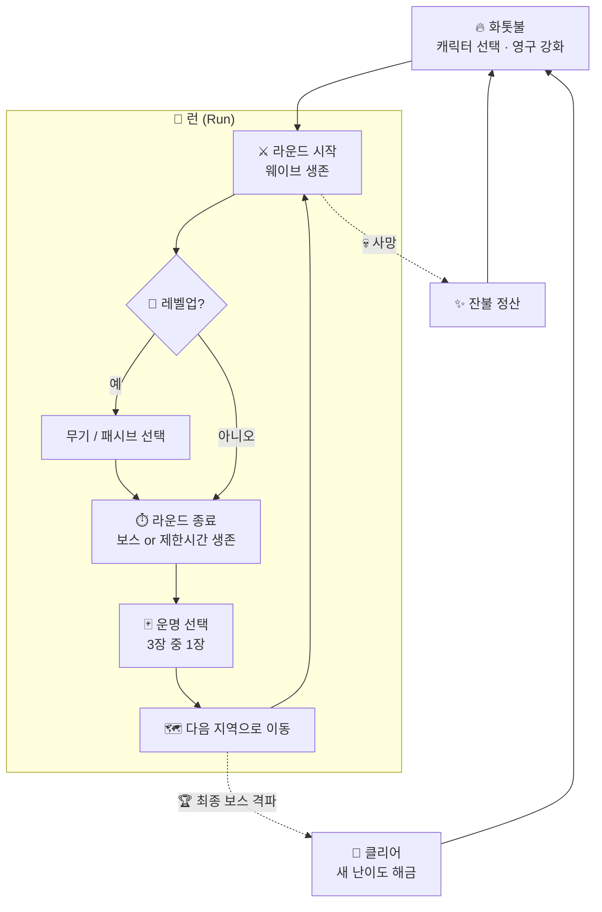

<div align="center">

# 🔥 ASHBORN

### *재에서 다시 태어나는 자*

**죽음은 끝이 아니다. 더 강해져 돌아올 뿐.**

<br/>


<br/>

[🎮 소개](#-소개) •
[📜 세계관](#-세계관) •
[🔁 게임 루프](#-게임-루프) •
[⚙️ 핵심 시스템](#️-핵심-시스템) •
[🗺️ 지역](#️-지역) •
[🛠️ 기술 스택](#️-기술-스택) •
[🧭 로드맵](#-로드맵)

</div>

---

## 🎮 소개

**Ashborn**은 *Vampire Survivors* 스타일의 **탑다운 오토 슈터**에 **로그라이크 라운드 진행**과 **영구 성장(메타 프로그레션)** 을 결합한 2D 액션 게임입니다.

> 몰려오는 적의 물결 속에서 살아남고, 라운드가 끝날 때마다 **운명을 하나 골라** 다음 땅으로 나아가세요.
> 쓰러지면 남은 **잔불(Ember)** 을 모아 화톳불에서 자신을 단련하고, 다시 일어서세요.

<table>
<tr>
<td align="center" width="25%">⚔️<br/><b>자동 전투</b><br/><sub>이동만 하세요.<br/>공격은 알아서.</sub></td>
<td align="center" width="25%">🎲<br/><b>운명 선택</b><br/><sub>라운드마다 3장 중 1장,<br/>매번 다른 빌드.</sub></td>
<td align="center" width="25%">🗺️<br/><b>지역 이동</b><br/><sub>라운드를 넘을수록<br/>더 깊고 위험한 땅으로.</sub></td>
<td align="center" width="25%">🔥<br/><b>죽음 = 성장</b><br/><sub>잔불을 모아<br/>영구적으로 강화.</sub></td>
</tr>
</table>

---

## 📜 세계관

<details open>
<summary><b>프롤로그 펼치기 / 접기</b></summary>

<br/>

> *한때 세상을 밝히던 「태초의 불꽃」이 꺼진 날, 세계는 잿빛으로 물들었다.*
>
> *꺼진 불꽃의 잔해에서 **잿빛 역병(Ash Blight)** 이 피어올랐고, 그것에 삼켜진 생명은 영혼 없는 **재의 무리(Hollow)** 가 되어 남은 빛을 갉아먹기 시작했다.*
>
> *그러나 모든 불씨가 꺼진 것은 아니었다.*
> *마지막 **화톳불(The Hearth)** 곁에서, 재 속에서 몸을 일으키는 자들이 있었다.*
> *죽어도 죽지 않고, 쓰러질 때마다 불꽃을 품고 다시 태어나는 자들.*
>
> *사람들은 그들을 **애쉬본(Ashborn)** 이라 불렀다.*

</details>

### 목표

플레이어는 애쉬본이 되어 역병의 근원인 **「꺼지지 않는 심장」** 까지 나아가 태초의 불꽃을 되살려야 합니다.
한 번에 닿을 수는 없습니다. **죽고, 단련하고, 다시 도전하는 것** 자체가 이 이야기의 일부입니다.

### 주요 용어

| 용어 | 설명 |
|:---|:---|
| 🔥 **화톳불 (The Hearth)** | 런 사이의 거점. 사망 후 귀환하는 곳이며 영구 강화를 진행합니다. |
| ✨ **잔불 (Ember)** | 런 중 획득하는 영구 재화. 죽어도 사라지지 않습니다. |
| 💎 **재의 결정 (Ash Shard)** | 적이 떨어뜨리는 경험치. 해당 런에서만 유효합니다. |
| 🃏 **운명 (Fate)** | 라운드 종료 시 선택하는 랜덤 보상 카드. |
| 👤 **재의 무리 (Hollow)** | 역병에 삼켜진 적 개체들의 총칭. |

---

## 🔁 게임 루프



### 두 개의 성장 축

| 구분 | 🎯 런 내 성장 (휘발성) | 🔥 메타 성장 (영구) |
|:---|:---|:---|
| **재화** | 재의 결정 (경험치) | 잔불 (Ember) |
| **획득** | 적 처치 | 처치 수 · 생존 시간 · 도달 라운드 |
| **사용처** | 레벨업 시 무기·패시브 선택 | 화톳불에서 능력치·해금 구매 |
| **유지** | 사망 시 초기화 | 영구 보존 |

---

## ⚙️ 핵심 시스템

### ⚔️ 전투 (Vampire Survivors 스타일)

- **이동만 직접 조작**하고 공격은 장착한 무기가 쿨다운마다 **자동 발동**합니다.
- 적은 시간이 지날수록 더 많이, 더 강하게 몰려옵니다.
- 적이 떨어뜨린 **재의 결정**을 모아 레벨업하고, 레벨업마다 **무기 또는 패시브 중 1개**를 고릅니다.
- 무기는 최대 레벨 + 특정 패시브 조합 시 **각성(Evolution)** 합니다.

### 🃏 운명 시스템 (라운드 간 랜덤 요소)

라운드를 마치면 무작위 **운명 카드 3장**이 제시되고, 그중 **1장**을 선택합니다.

| 등급 | 색상 | 예시 |
|:---:|:---:|:---|
| 일반 | ⚪ | 최대 체력 +10%, 이동 속도 +5% |
| 희귀 | 🔵 | 무기 1종 즉시 +2레벨, 자석 범위 대폭 증가 |
| 영웅 | 🟣 | 처치 시 일정 확률로 폭발, 피격 시 주변 화염 |
| 전설 | 🟡 | 무기 슬롯 +1, 한 번 부활 |
| **저주** | 🔴 | **위험 대신 보상**: 적 체력 +30% 대신 잔불 획득량 2배 |

> 💡 **리롤**: 마음에 드는 카드가 없으면 리롤할 수 있습니다. 리롤 횟수는 메타 성장으로 늘릴 수 있습니다.

<details>
<summary><b>운명 카드 카테고리 (기획 초안)</b></summary>

<br/>

- **🗡️ 무기 운명**: 새 무기 획득, 기존 무기 강화
- **🛡️ 축복 운명**: 런 동안 유지되는 능력치 버프
- **🌀 변이 운명**: 다음 지역의 규칙을 바꿈 (예: 밤 지역, 적 속도 증가, 엘리트 출현률 증가)
- **💀 저주 운명**: 페널티와 큰 보상을 동시에 부여
- **🎁 즉발 운명**: 체력 회복, 잔불 즉시 획득, 재의 결정 대량 획득

</details>

### 🔥 화톳불 (메타 프로그레션)

사망하거나 클리어하면 화톳불로 돌아와 **잔불**을 사용해 영구 강화를 진행합니다.

| 분류 | 강화 항목 |
|:---|:---|
| 💪 **기본 능력** | 최대 체력 · 공격력 · 이동 속도 · 방어력 · 회복력 |
| 🧲 **편의** | 획득 범위 · 경험치 획득량 · 잔불 획득량 |
| 🎲 **운명 조작** | 리롤 횟수 · 선택지 수(3 → 4장) · 고등급 카드 확률 |
| 🔓 **해금** | 새 캐릭터 · 시작 무기 · 새 운명 카드 · 상위 난이도 |

### 👤 캐릭터 (초안)

| 캐릭터 | 컨셉 | 시작 무기 | 고유 특성 |
|:---|:---|:---|:---|
| 🛡️ **잿불 기사** | 근접 탱커 | 불꽃 대검 (주변 회전 베기) | 받는 피해 감소 |
| 🔮 **재의 마녀** | 원거리 마법사 | 잔불 구체 (유도 투사체) | 쿨다운 감소 |
| 🏹 **불씨 사냥꾼** | 기동형 딜러 | 화염 석궁 (관통 화살) | 이동 속도 증가 |

---

## 🗺️ 지역

한 번의 런은 **5개 지역**으로 구성되며, 각 지역의 마지막에는 보스가 기다립니다.

| # | 지역 | 분위기 | 특징 |
|:---:|:---|:---|:---|
| 1 | 🌫️ **잿빛 평원** | 잿가루가 흩날리는 황야 | 튜토리얼 성격, 기본 적 위주 |
| 2 | ⛪ **가라앉은 성당** | 물에 잠긴 폐허 | 좁은 통로, 원거리 적 등장 |
| 3 | 🌲 **불타는 숲** | 영원히 타오르는 숲 | 지형 화염 피해, 빠른 적 |
| 4 | 🏰 **녹슨 요새** | 무너진 기사단의 성채 | 엘리트 · 방어형 적 다수 |
| 5 | ❤️‍🔥 **꺼지지 않는 심장** | 역병의 근원 | 최종 보스 |

---

## 🛠️ 기술 스택

| 분류 | 사용 기술 |
|:---|:---|
| **언어 / 프레임워크** | Dart · Flutter |
| **게임 엔진** | [Flame](https://flame-engine.org/) |
| **충돌 / 물리** | Flame 내장 충돌 감지 (`HasCollisionDetection`) |
| **오디오** | `flame_audio` |
| **맵** | `flame_tiled` (Tiled 에디터) *검토 중* |
| **상태 관리** | Riverpod 또는 Bloc *검토 중* |
| **로컬 저장** | Hive 또는 shared_preferences *검토 중* |

---

## 📁 프로젝트 구조 (예정)

```text
ashborn/
├── assets/
│   ├── images/          # 스프라이트, 타일셋, UI
│   ├── audio/           # BGM, 효과음
│   └── data/            # 무기 · 적 · 운명 카드 정의 (JSON)
│
├── lib/
│   ├── main.dart
│   ├── game/
│   │   ├── ashborn_game.dart    # FlameGame 루트
│   │   └── world/               # 지역(맵), 스폰 관리
│   ├── components/
│   │   ├── player/              # 플레이어, 캐릭터별 특성
│   │   ├── enemies/             # 재의 무리, 엘리트, 보스
│   │   ├── weapons/             # 자동 공격 무기, 투사체
│   │   └── pickups/             # 재의 결정, 아이템
│   ├── systems/
│   │   ├── wave_system.dart     # 웨이브 · 난이도 곡선
│   │   ├── level_system.dart    # 경험치 · 레벨업
│   │   ├── fate_system.dart     # 운명 카드 추첨 · 적용
│   │   └── meta_system.dart     # 잔불 · 영구 강화
│   ├── data/                    # 모델, 저장소, 세이브
│   └── ui/
│       ├── hud/                 # 체력바, 경험치바, 타이머
│       ├── overlays/            # 레벨업 · 운명 선택 · 일시정지
│       └── screens/             # 타이틀, 화톳불(허브), 결과
│
└── test/
```

---

## 🧭 로드맵

- [ ] **Phase 0 · 기반** : Flutter + Flame 프로젝트 세팅, 폴더 구조
- [ ] **Phase 1 · 코어 전투** : 플레이어 이동, 적 스폰·추적, 자동 공격 무기 1종
- [ ] **Phase 2 · 런 내 성장** : 재의 결정, 레벨업 선택 UI, 무기 3종 · 패시브 3종
- [ ] **Phase 3 · 라운드 & 지역** : 라운드 종료 조건, 보스, 지역 전환
- [ ] **Phase 4 · 운명 시스템** : 카드 추첨 · 등급 · 리롤 · 저주
- [ ] **Phase 5 · 메타 성장** : 잔불 정산, 화톳불 허브, 영구 강화, 세이브
- [ ] **Phase 6 · 콘텐츠 확장** : 캐릭터 3종, 지역 5개, 무기 각성
- [ ] **Phase 7 · 폴리싱** : 사운드, 이펙트, 밸런싱, 모바일 조작 최적화

---

## 🚀 시작하기

> ⚠️ 아직 프로젝트 초기 단계입니다. 코드가 추가되면 이 섹션이 업데이트됩니다.

```bash
git clone https://github.com/seeminglyjs/ashborn.git
cd ashborn
flutter pub get
flutter run
```

---

<div align="center">

**🔥 Fall. Burn. Rise again. 🔥**

<sub>Made with Flutter & Flame</sub>

</div>
