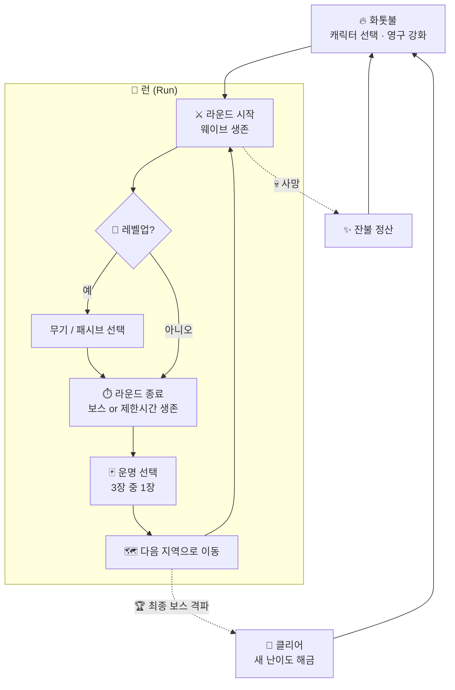

<div align="center">

# 🔥 ASHBORN

### *재에서 다시 태어나는 자*

**죽음은 끝이 아니다. 더 강해져 돌아올 뿐.**

<br/>


<br/>

[🎮 소개](#-소개) •
[📜 세계관](#-세계관) •
[🔁 게임 루프](#-게임-루프) •
[⚙️ 핵심 시스템](#️-핵심-시스템) •
[🗺️ 지역](#️-지역) •
[🛠️ 기술 스택](#️-기술-스택) •
[🧭 로드맵](#-로드맵)

</div>

---

## 🎮 소개

**Ashborn**은 *Vampire Survivors* 스타일의 **탑다운 오토 슈터**에 **로그라이크 라운드 진행**과 **영구 성장(메타 프로그레션)** 을 결합한 2D 액션 게임입니다.

> 몰려오는 적의 물결 속에서 살아남고, 라운드가 끝날 때마다 **운명을 하나 골라** 다음 땅으로 나아가세요.
> 쓰러지면 남은 **잔불(Ember)** 을 모아 화톳불에서 자신을 단련하고, 다시 일어서세요.

<table>
<tr>
<td align="center" width="25%">⚔️<br/><b>자동 전투</b><br/><sub>이동만 하세요.<br/>공격은 알아서.</sub></td>
<td align="center" width="25%">🎲<br/><b>운명 선택</b><br/><sub>라운드마다 3장 중 1장,<br/>매번 다른 빌드.</sub></td>
<td align="center" width="25%">🗺️<br/><b>지역 이동</b><br/><sub>라운드를 넘을수록<br/>더 깊고 위험한 땅으로.</sub></td>
<td align="center" width="25%">🔥<br/><b>죽음 = 성장</b><br/><sub>잔불을 모아<br/>영구적으로 강화.</sub></td>
</tr>
</table>

---

## 📜 세계관

<details open>
<summary><b>프롤로그 펼치기 / 접기</b></summary>

<br/>

> *한때 세상을 밝히던 「태초의 불꽃」이 꺼진 날, 세계는 잿빛으로 물들었다.*
>
> *꺼진 불꽃의 잔해에서 **잿빛 역병(Ash Blight)** 이 피어올랐고, 그것에 삼켜진 생명은 영혼 없는 **재의 무리(Hollow)** 가 되어 남은 빛을 갉아먹기 시작했다.*
>
> *그러나 모든 불씨가 꺼진 것은 아니었다.*
> *마지막 **화톳불(The Hearth)** 곁에서, 재 속에서 몸을 일으키는 자들이 있었다.*
> *죽어도 죽지 않고, 쓰러질 때마다 불꽃을 품고 다시 태어나는 자들.*
>
> *사람들은 그들을 **애쉬본(Ashborn)** 이라 불렀다.*

</details>

### 목표

플레이어는 애쉬본이 되어 역병의 근원인 **「꺼지지 않는 심장」** 까지 나아가 태초의 불꽃을 되살려야 합니다.
한 번에 닿을 수는 없습니다. **죽고, 단련하고, 다시 도전하는 것** 자체가 이 이야기의 일부입니다.

### 주요 용어

| 용어 | 설명 |
|:---|:---|
| 🔥 **화톳불 (The Hearth)** | 런 사이의 거점. 사망 후 귀환하는 곳이며 영구 강화를 진행합니다. |
| ✨ **잔불 (Ember)** | 런 중 획득하는 영구 재화. 죽어도 사라지지 않습니다. |
| 🪙 **골드 · 강화석** | 처치와 보스로 얻는 영구 재화. 장비 강화와 캐릭터 해금에 씁니다. |
| 🌟 **초월석** | 보스가 확률로 떨어뜨리는 재료. 골드와 함께 장비 초월에 씁니다. |
| 💎 **재의 결정 (Ash Shard)** | 적이 떨어뜨리는 경험치. 해당 런에서만 유효합니다. |
| 🃏 **운명 (Fate)** | 라운드 종료 시 선택하는 랜덤 보상 카드. |
| 👤 **재의 무리 (Hollow)** | 역병에 삼켜진 적 개체들의 총칭. |

---

## 🔁 게임 루프



### 두 개의 성장 축

| 구분 | 🎯 런 내 성장 (휘발성) | 🔥 메타 성장 (영구) |
|:---|:---|:---|
| **재화** | 재의 결정 (경험치) | 잔불 (Ember) |
| **획득** | 적 처치 | 처치 수 · 생존 시간 · 도달 라운드 |
| **사용처** | 레벨업 시 무기·패시브 선택 | 화톳불에서 능력치·해금 구매 |
| **유지** | 사망 시 초기화 | 영구 보존 |

---

## ⚙️ 핵심 시스템

### ⚔️ 전투 (Vampire Survivors 스타일)

- **이동만 직접 조작**하고 공격은 장착한 무기가 쿨다운마다 **자동 발동**합니다.
- 적은 시간이 지날수록 더 많이, 더 강하게 몰려옵니다.
- 적이 떨어뜨린 **재의 결정**을 모아 레벨업하고, 레벨업마다 **무기 또는 패시브 중 1개**를 고릅니다.
- 무기는 최대 레벨 + 짝이 되는 패시브를 가지면 레벨업 때 **각성(Evolution)** 을 고를 수 있습니다. 각성하면 피해 ×1.5에 무기마다 새 효과가 붙습니다.

| 무기 | + 패시브 | 각성 | 효과 |
|:---|:---|:---|:---|
| 강철 대검 | 단련된 육체 | **거신의 대검** | 범위 1.3배, 콤보 확률 +25% |
| 잔불 구체 | 불씨 끌림 | **유성 잔불** | 맞힌 자리에서 터져 주변 적에게 60% 피해 |
| 사냥 석궁 | 재바람 | **폭풍 석궁** | 화살 3발 부채꼴, 관통 +3 |

#### 직업 기본 무기: 레벨마다 기술을 익힌다

| 무기 | 익히는 기술 |
|:---|:---|
| 강철 대검 (기사) | 1레벨 **찌르기** (앞쪽 일직선 관통) → 2레벨 **휘두르기** (앞쪽 부채꼴) → 3레벨 **내려찍기** (앞쪽 원형 충격 + 밀쳐내기). 쿨다운마다 익힌 기술을 차례로 하나씩 쓰고, 레벨이 오를수록 커지는 확률로 다음 기술을 곧바로 잇는다 (**콤보**). 4레벨 **맹공**: 콤보가 2번 연달아 나면 4초 동안 쿨다운 ×0.6. **대검의 무게**: 장비 피해까지 포함한 한 타 전체에 찌르기 ×2.0 · 휘두르기 ×1.5 · 내려찍기 ×2.8 (타격 수가 적은 대신 한 방이 무겁다) |
| 잔불 구체 (마녀) | 4레벨 **과열**: 4번째 시전마다 큰 화염구(피해 ×2, 맞힌 자리에서 폭발)를 하나 더 쏜다 |
| 사냥 석궁 (사냥꾼) | 2레벨 **연사**: 확률로 0.12초 뒤 한 번 더 쏜다 · 4레벨 **저격**: 4번째 사격마다 피해 ×2.5, 끝없이 꿰뚫는 화살 |

#### 직업 패시브 · 직업 숙련

캐릭터마다 고유 패시브가 셋 있고, 각각 최대 10레벨입니다. 포인트는 **직업 숙련**으로 얻습니다:
그 캐릭터로 런에서 모은 경험치가 숙련 경험치로 쌓이고(보스를 잡으면 120 × 스테이지 레벨 더), 숙련 레벨이 하나 오를 때마다 포인트 1.
숙련 레벨 L → L+1 경험치는 800 × 1.12^L 이며, 포인트는 쓴 포인트당 골드 400 으로 되돌릴 수 있습니다. 캐릭터 선택 화면의 **숙련** 버튼에서 올립니다.

| 직업 | 패시브 | 1레벨 → 10레벨 |
|:---|:---|:---|
| 기사 | **튕겨내기** | 피격 시 6% → 24% 확률로 막아 내고, 받을 뻔한 피해의 ×1.5 → ×4.65 를 공격한 적에게 돌려줌 (탄 · 장판은 가장 가까운 적에게) |
| | **연격 숙련** | 대검 콤보 확률 +3% → +30%, 맹공 +0.25초 → +2.5초 |
| | **강철 의지** | 받는 피해 -3% → -21% |
| 마녀 | **원소 친화** | 점화 · 냉각 · 감전 축적 +10% → +100%, 점화 피해 +10% → +100% |
| | **잔향 시전** | 무기가 4% → 22% 확률로 곧바로 한 번 더 발동 |
| | **재의 장막** | 15초 → 6초마다 피해 1회를 막는 장막 |
| 사냥꾼 | **맹독 바르기** | 중독 확률 +5% → +27.5%, 중독 피해 +10% → +100% |
| | **질주 사격** | 움직이는 동안 공격 속도 +5% → +27.5% |
| | **급소 노리기** | 치명타 확률 +3% → +13.8%, 치명타 피해 +10% → +55% |

### 🃏 운명 시스템 (라운드 간 랜덤 요소)

지역 보스를 잡으면 무작위 **운명 카드 3장**이 제시되고, 그중 **1장**을 고르면 다음 지역으로 넘어갑니다. 효과는 **그 런이 끝날 때까지** 유지됩니다.

카드는 **스탯 · 스킬 · 보상** 세 종류입니다. 종류 조합은 고정이 아니며, **같은 종류는 최대 2장, 보상은 최대 1장**까지 나옵니다.

**카드 등급**: 카드는 뽑힐 때마다 장비와 같은 **6등급**(노말 · 레어 · 영웅 · 전설 · 에픽 · 고유) 중 하나를 갖습니다.
- 등급이 오를 때마다 나올 확률은 0.4배로 줄고(장비보다 완만), 타락 단계의 등급 운도 똑같이 붙습니다.
- 카드마다 **최소 등급**이 있고, 그 위로 한 등급마다 수치가 **1.4배**가 됩니다. 레벨처럼 정수인 효과는 두 등급마다 +1.
- 뽑은 등급이 그 종류 카드의 최소 등급보다 낮으면 최소 등급으로 올라갑니다 (스킬 카드는 레어부터).
- 카드 한 장이 10% 확률로 **저주**로 나옵니다 (저주가 있는 스탯 · 보상에서만). 저주의 페널티는 고정이고 보상만 등급만큼 커집니다.

| 종류 | 카드 (최소 등급의 수치) |
|:---|:---|
| 📈 **스탯** | 노말: 최대 체력 +20 · 이동 속도 +8% · 피해 +10% · 획득 범위 +40% · 방어력 +15<br/>레어: 공격 속도 +15% · 치명타 확률 +8%<br/>영웅: 생명력 흡수 +3%<br/>전설: 피해 +30% · 최대 체력 +50<br/>저주: 최대 체력 -30 대신 피해 +40% |
| ✨ **스킬** | 레어: 무기 하나 즉시 +2레벨 · 새 무기 획득<br/>영웅: 잿불 폭발 · 서리 갑옷 · 연쇄 번개 (고유 장비와 같은 세기에서 시작)<br/>전설: 한 번 더 부활 (체력 50%) · 광전사의 분노 |
| 🎁 **보상** | 노말: 체력 50% 회복 · 잔불 즉시 획득 · 경험치 획득 +20%<br/>레어: 즉시 2레벨 상승 · 잔불 획득량 +30% · 장비 드랍 확률 +30%<br/>저주: 적 체력 +30% 대신 잔불 +100% · 적 피해 +30% 대신 장비 드랍 +100% |

- 스탯 · 보상 카드와 저주는 **여러 번 고르면 겹칩니다** (저주 배율은 곱해짐). 더 올릴 무기가 없는 무기 카드는 나오지 않습니다.
- 효과 카드는 **이미 가진 효과보다 높은 등급일 때만** 다시 나오고, 고유 장비와 겹치면 센 쪽을 씁니다.
- 불사조의 깃털 부활은 고유 장비 「불사조의 재」와 따로 셉니다.

> 💡 **리롤**: 마음에 드는 카드가 없으면 런마다 **1번** 다시 뽑을 수 있습니다. 리롤 횟수는 메타 성장으로 늘릴 예정입니다.

<details>
<summary><b>운명 카드 카테고리 (기획 초안)</b></summary>

<br/>

- **🗡️ 무기 운명**: 새 무기 획득, 기존 무기 강화 ✅
- **🛡️ 축복 운명**: 런 동안 유지되는 능력치 버프 ✅
- **🌀 변이 운명**: 다음 지역의 규칙을 바꿈 (예: 밤 지역, 적 속도 증가, 엘리트 출현률 증가) ⬜ 미구현
- **💀 저주 운명**: 페널티와 큰 보상을 동시에 부여 ✅
- **🎁 즉발 운명**: 체력 회복, 잔불 즉시 획득, 재의 결정 대량 획득 ✅

</details>

### 🔥 화톳불 (메타 프로그레션)

사망하거나 클리어하면 화톳불(캐릭터 선택 화면)로 돌아와 **잔불**로 영구 강화를 삽니다. 강화는 **모든 캐릭터**에 붙고 기기에 저장됩니다.
게임 오버 화면에서 이번 런에 얻은 잔불 · 골드 · 강화석과 보유 잔불을 정산해 보여 줍니다. 장비 강화는 골드와 강화석으로 합니다.

다음 레벨 비용은 레벨마다 **1.5배**씩 늡니다.

| 분류 | 강화 | 레벨당 | 최대 | 첫 비용 |
|:---|:---|:---|:---:|---:|
| 💪 **기본 능력** | 단단한 몸 | 최대 체력 +10 | 100 | 30 |
| | 불꽃의 힘 | 피해 +5% | 100 | 40 |
| | 가벼운 발 | 이동 속도 +3% | 5 | 40 |
| | 재의 피부 | 방어력 +5 | 100 | 30 |
| | 꺼지지 않는 불씨 | 체력 재생 +0.2/초 | 5 | 50 |
| 🧲 **편의** | 불씨 부름 | 획득 범위 +10% | 5 | 30 |
| | 깨달음 | 경험치 획득 +5% | 10 | 40 |
| | 잔불 수확 | 잔불 획득량 +5% | 10 | 60 |
| 🎲 **운명 조작** | 운명 거스르기 | 다시 뽑기 +1회 | 3 | 200 |
| | 넓어진 시야 | 운명 카드 3 → 4장 | 1 | 1500 |
| | 별의 가호 | 운명 카드 등급 운 +10% | 5 | 150 |

> 🔓 **캐릭터 해금**은 골드로 합니다 (아래 캐릭터 표). 시작 무기 · 새 운명 카드 · 상위 난이도 해금은 아직 없습니다.

### 🎒 장비

사냥 중 적이 **무작위로 장비를 떨어뜨립니다** (처치당 2%). 장비는 **영구 보관**되며, 가방(100칸)은 모든 캐릭터가 함께 쓰고 **장착 칸은 캐릭터마다 따로**입니다.
주운 장비는 그 캐릭터의 빈 칸에 바로 장착되고, 아니면 가방에 들어갑니다. 가방이 차면 낄 칸이 없는 장비는 바닥에 남습니다.
장비 화면은 **캐릭터 선택 화면(출정 전)** 과 런 중 HUD의 가방 버튼에서 열 수 있고, 장착 · 교체(능력치 비교 표시) · 강화 · 분해(영웅 이상은 확인 창)를 할 수 있습니다.
맨 위의 **종합 전투력**(공격력과 버티는 힘의 기하평균, 화톳불 강화 · 은총 포함)을 가장 높이는 장비를 **자동 장착** 버튼이 골라 낍니다.
**일괄 분해** 창에서 고른 등급 · 강화 제외는 저장되어 다음에도 남고, **주울 때 자동 분해**를 켜면 그 등급 장비는 주우면 바로 잔불이 됩니다 (빈 칸에 낄 장비 · 전투력이 오르는 장비는 남김).
런 중 일시정지 메뉴의 **카드 · 은총** 에서 이번 런의 무기 · 패시브 카드와 받은 은총을 한눈에 봅니다.

| 등급 | 드랍 확률 | 수치 배율 | 랜덤옵션 1칸 확률 (최대 5칸) |
|:---:|---:|---:|---:|
| ⚪ 노말 | 75.0% | ×1.0 | 10% |
| 🔵 레어 | 18.8% | ×1.4 | 25% |
| 🟣 영웅 | 4.7% | ×2.0 | 40% |
| 🟠 전설 | 1.2% | ×2.7 | 55% |
| 🔴 에픽 | 0.29% | ×3.8 | 70% |
| 🟢 고유 | 0.07% | ×5.4 | 85% |

- 등급이 하나 오를 때마다 드랍 확률은 1/4, 수치는 1.4배. 수치는 기준값의 ±20% 안에서 무작위.
- **랜덤옵션에도 등급이 있습니다.** 옵션 등급은 장비 등급과 따로 뽑히지만(낮을수록 흔함), **장비 등급보다 높을 수는 없습니다.** 예: 노말 장비에는 노말 옵션만, 고유 장비에는 노말~고유 옵션.
- 주옵션은 장비와 같은 등급입니다.

| 파츠 | 칸 | 주옵션 (하나가 무작위) |
|:---|:---:|:---|
| 머리 | 1 | 최대 체력 · 에너지 보호막 |
| 장화 | 1 | 이동 속도 · 회피 |
| 양손장비 | 두 손 모두 | 물리/화염/냉기/번개/바람 피해 (한손의 2배) |
| 한손장비 | 손당 1 (최대 2) | 물리/화염/냉기/번개/바람 피해 |
| 장갑 | 1 | 공격 속도 · 치명타 확률 |
| 목걸이 | 1 | 피해 증가 · 치명타 피해 |
| 반지 | 2 | 물리 피해 감소 · 화염/냉기/번개/바람 저항 |
| 허리띠 | 1 | 방어력 · 최대 체력 |
| 귀걸이 | 2 | 획득 범위 · 경험치 획득 · 체력 재생 |

#### 능력치

| 분류 | 능력치 | 동작 |
|:---|:---|:---|
| 생존 | 최대 체력 · 체력 재생 · 생명력 흡수 | 체력이 0이 되면 사망. 흡수는 준 피해의 일부를 회복 |
| 공격 | 물리 · 화염 · 냉기 · 번개 · 바람 피해 | 모든 무기의 매 타격에 고정치로 더해짐 |
| | 피해 증가 · 공격 속도 · 치명타 확률/피해 | 피해 전체에 곱해짐 (치명타 기본 150%) |
| 상태이상 | 출혈 · 중독 확률, 점화 · 냉각 · 감전 축적, 각 피해 | 출혈은 물리 피해가 섞인 타격에, 중독은 모든 타격에 확률로. 점화 · 냉각 · 감전은 그 속성 피해가 쌓여서 걸리고, 축적은 쌓이는 양을 늘림 |
| 방어 | 방어력 · 회피 · 에너지 보호막 | 방어력은 물리 피해 감소, 회피는 피격 무효(최대 75%), 보호막은 체력보다 먼저 깎이고 3초간 안 맞으면 재충전 |
| 피해 감소 | 물리 피해 감소 · 화염/냉기/번개/바람 저항 | 해당 속성 피해를 비율로 감소 (최대 75%) |
| 편의 | 이동 속도 · 획득 범위 · 경험치 획득 | |

> 상태이상 (지속 시간은 모두 5초 기준):
> - **중독**: 타격 피해만큼을 5초에 나눠 주고 이동 · 공격 속도 15% 감소. 겹치지 않고 마지막 중독으로 덮어씀. 1초마다 8% 확률로 옆의 적에게 전염.
> - **출혈**: 물리 피해만큼이 기준이고 1초마다 초당 피해가 20%씩 커짐 (5초 평균 1.5배). 출혈 중에 맞으면 피해 +15%. 피가 떨어지는 연출.
> - **점화**: 화염 피해가 적 최대 체력의 30% (보스 2%) 만큼 쌓이면 불이 붙어 4초 동안 0.5초마다 점화시킨 화염 피해의 10%. 1초마다 8% 확률로 옆의 적에게 번짐. 불타는 연출.
> - **냉각 → 동결**: 냉기 피해가 문턱만큼 쌓이면 냉각(3초, 이동 · 공격 속도 25% 감소, 파래짐). 냉각 중에 또 쌓이면 1초 동결(보스 0.5초, 몸 크기의 얼음). 얼어 있다 쓰러지면 6방향 얼음 파편이 동결시킨 냉기 피해만큼 냉기 피해.
> - **감전**: 번개 피해가 문턱만큼 쌓이면 0.3초 경직 + 주변 적 3명에게 감전시킨 번개 피해의 60% 연쇄 번개.
> - **바람**: 바람 피해가 섞인 타격에 12% 확률로 바람 검기(일직선 관통, 바람 피해 ×1.5), 4% 확률로 소용돌이(2초, 넓은 범위로 끌어당기며 0.25초마다 ×0.6 = 총 ×4.8). 각각 재사용 대기 0.35초 · 1.2초.
> - 쌓인 화염 · 냉기 · 번개는 초당 문턱의 15%씩 빠집니다.
> 적은 지역마다 다른 속성 피해를 줍니다 (아래 지역 표). 해당 속성 저항이 그 피해를 줄입니다.

#### 장비 레벨 · 재화 · 강화

| 항목 | 내용 |
|:---|:---|
| 장비 레벨 | 떨어진 스테이지의 레벨. 고정치 옵션(체력, 속성 피해, 방어력, 보호막, 재생)은 레벨마다 ×1.15. 비율 옵션(%)은 상한이 있어 레벨 영향 없음 |
| 보스 상자 | 보스를 잡으면 레어 이상 장비 3개가 떨어짐 |
| 잔불 획득 | 스테이지 클리어 (20 × 레벨, 타락 보너스), 처치 (0.2 × 레벨, 클리어나 사망 때 정산), 장비 분해 |
| 분해 | 가방의 장비를 잔불로 바꿈. 높은 등급 · 레벨 · 강화일수록 많이 |
| 골드 · 강화석 획득 | 처치마다 골드 1 × 레벨, 3% 확률로 강화석 (타락 보너스). 보스는 골드 50 × 레벨과 강화석 3개 (+타락 단계). 처치분은 클리어나 사망 때 정산 |
| 강화 | **강화석 + 골드**로 +1 ~ **+30**. **확률 없이 늘 성공**하고, 단계가 오를수록 재료가 가파르게 는다. 단계마다 모든 옵션 **×1.1 (복리)**: +20 은 약 6.7배, +30 은 약 17배 |

**강화 비용** (지금 단계 → 다음 단계)

- 강화석: 1 + 단계 + 단계² ÷ 6 (내림). +0 → +1 은 1개, +10 → +11 은 27개, +29 → +30 은 170개
- 골드: 50 × 1.16^단계 × 1.5^등급 × 장비 레벨 배율
- 예전 확률 강화의 기대 비용과 비슷하게 맞췄습니다. 최대 단계는 `Balance.maxEnhance` 로 올릴 수 있습니다.

**강화 계승**: 장착한 장비를 더 낮은 강화의 새 장비로 바꾸면 두 장비의 **강화 단계를 맞바꿉니다**. 끼우는 장비가 둘 중 높은 강화를, 빠지는 장비가 낮은 강화를 갖습니다 (양손장비가 두 손을 밀어내면 그중 높은 쪽). 이미 더 높게 강화된 장비를 끼우면 아무것도 바뀌지 않습니다.
초월 단계 · 초월 옵션은 장비에 그대로 남습니다. 장비 비교 화면에 `강화 계승 +a → +b` 와 계승 후 능력치 변화가 표시됩니다.

#### 초월

**+20 이상 강화한 영웅 이상 장비**는 초월할 수 있습니다. 초월할 때마다 기본 옵션 · 랜덤옵션에는 없는 **초월 옵션**을 **직접 골라** 하나씩 붙이고(한 장비에 같은 옵션은 한 번만), 강화 단계는 그대로 남습니다. **확률 없이 늘 성공**합니다.

| 등급 | 최대 초월 | | 단계 | 초월석 | 골드 |
|:---|:---:|:---:|:---:|:---:|:---|
| 영웅 | ★1 | | ★0 → ★1 | 2 | 6000 × 레벨 배율 |
| 전설 | ★2 | | ★1 → ★2 | 5 | 18000 × 레벨 배율 |
| 에픽 · 고유 | ★3 | | ★2 → ★3 | 12 | 54000 × 레벨 배율 |
- **초월석**은 보스만 떨어뜨립니다: 보스마다 25% + 타락 단계당 5%.

| 초월 옵션 | 효과 (고정 수치) |
|:---|:---|
| 투사체 | 모든 무기 투사체 +1 (강철 대검 · 사냥 석궁은 콤보 · 연사 확률 +10%) |
| 보스 피해 | 보스에게 주는 피해 +25% |
| 처치 시 회복 | 적 처치 시 체력 0.5 회복 |
| 가시 | 부딪힌 적에게 받은 피해의 50% 반사 |
| 불굴 | 체력 30% 이하일 때 받는 피해 -30% |
| 골드 획득 | 골드 획득량 +30% |

#### 고유 효과

고유 등급 장비에는 아래 특수 효과 중 하나가 붙습니다 (같은 효과는 겹치지 않음).

| 효과 | 내용 |
|:---|:---|
| 불사조의 재 | 쓰러지면 런마다 한 번, 체력 50%로 되살아남 |
| 잿불 폭발 | 적 처치 시 25% 확률로 주변에 화염 폭발 |
| 연쇄 번개 | 타격 시 15% 확률로 가까운 적 3명에게 번개 |
| 서리 갑옷 | 피격 시 주변 적 이동 속도 60% 감소 (2초) |
| 광전사의 분노 | 잃은 체력 1%당 피해 1% 증가 |

### 👤 캐릭터 (초안)

| 캐릭터 | 컨셉 | 시작 무기 | 고유 특성 | 해금 |
|:---|:---|:---|:---|:---|
| 🛡️ **잿불 기사** | 근접 탱커 | 강철 대검 (찌르기 · 휘두르기 · 내려찍기 콤보) | 받는 피해 감소 | 처음부터 |
| 🔮 **재의 마녀** | 원거리 마법사 | 잔불 구체 (유도 투사체) | 쿨다운 감소 | 골드 10,000 |
| 🏹 **불씨 사냥꾼** | 기동형 딜러 | 사냥 석궁 (관통 화살 · 연사 · 저격) | 이동 속도 증가 | 골드 30,000 |

캐릭터 선택 화면에서 잠긴 캐릭터를 고르면 **모은 골드 / 해금 골드**가 표시되고, 출정 버튼이 해금 버튼으로 바뀝니다 (확인 창을 거쳐 해금).
카드 목록 끝에는 아직 공개하지 않은 캐릭터 자리가 **실루엣(???)** 으로 놓여 있습니다.

---

## 🗺️ 지역

**스테이지 = 타락 단계 × 지역**입니다. 스테이지마다 2분 동안 웨이브를 버티면 **지역 보스**가 나오고, 보스를 잡으면 전리품을 주운 뒤 **다음 지역으로** 가거나 **화톳불로 귀환**할 수 있습니다.
런은 늘 고른 타락 단계의 첫 지역에서 시작하고, 마지막 지역(꺼지지 않는 심장)의 보스를 잡으면 **그 타락 단계 클리어**로 런이 끝납니다. 처음 클리어하면 다음 타락 단계가 열립니다.

**이어 하기**: 클리어 화면에서 화톳불로 돌아가면 런이 캐릭터마다 남아, 다음에 **다음 지역부터 그때의 레벨 · 무기 · 패시브 카드로** 이어 합니다 (체력은 가득). 쓰러지거나(시간 초과 포함) 싸우는 도중에 나가면 포기로 보고 레벨과 카드가 사라집니다. 앱이 꺼지면 마지막으로 들어간 지역 처음부터 이어 합니다.

| # | 지역 | 보스 | 적 피해 속성 | 특징 |
|:---:|:---|:---|:---:|:---|
| 1 | 🌫️ **잿빛 평원** | 잿더미 거인 | 물리 | 기본 적 |
| 2 | ⛪ **가라앉은 성당** | 가라앉은 사제 | 냉기 | |
| 3 | 🌲 **불타는 숲** | 불타는 수호목 | 화염 | 빠른 적 (속도 ×1.25) |
| 4 | 🏰 **녹슨 요새** | 녹슨 기사단장 | 번개 | 단단하고 느린 적 (체력 ×1.4) |
| 5 | ❤️‍🔥 **꺼지지 않는 심장** | 꺼지지 않는 심장 | 바람 | 빠르고 단단한 적 |

보스는 졸개보다 훨씬 단단하고 아프며(체력 ×60, 피해 ×2), 4초마다 플레이어에게 돌진합니다.
보스방에는 **제한 시간 3분**이 있습니다. 시간 안에 보스를 잡지 못하면 쓰러진 것처럼 런이 끝나고(얻은 재화는 정산), 같은 스테이지에서 다시 도전할 수 있습니다. HUD 보스 체력 아래에 남은 시간이 표시됩니다.
첫 세 스테이지는 처음 하는 사람도 바로 넘어갈 수 있도록 적 체력 · 피해가 50% · 70% · 85% 입니다.

### 스테이지 레벨과 타락

| 구분 | 효과 |
|:---|:---|
| **스테이지 레벨** (1, 2, 3 … 끝없음) | 레벨마다 적 체력 ×1.35, 적 피해 ×1.2. 떨어지는 장비의 레벨이 됨 |
| **타락 단계** (루프마다 +1) | 몬스터: 이동 속도 +4% (최대 +40%) · 보상: 장비 드랍 확률 +25%, 높은 등급 가중치 +10%, 클리어 잔불 증가 |

**성장 곡선 의도**: 적은 스테이지마다 체력 ×1.35로 크지만, 그 스테이지에서 얻는 장비는 ×1.15만 큽니다.
초반은 한 번에 몇 스테이지씩 넘어가지만, 뒤로 갈수록 같은 스테이지를 여러 번 돌며 모은 골드 · 강화석으로 장비를 강화해야 보스를 제한 시간 안에 잡을 수 있습니다.
재화 수급(처치 · 클리어 보상)은 스테이지 레벨에 비례해 늘지만 적의 성장(지수)을 따라잡기는 점점 어려워집니다.

### 진행과 저장

- 가장 멀리 클리어한 스테이지가 저장됩니다 (모든 캐릭터 공용).
- 캐릭터 선택 화면에서 **출정할 스테이지를 고를 수 있습니다.** 기본값은 클리어한 다음 스테이지(최전선)이고, 그 이전 스테이지도 골라서 다시 도전할 수 있습니다.
- 쓰러지면 **쓰러진 스테이지부터 다시 도전**하거나 캐릭터 선택으로 돌아갈 수 있습니다.

---

## 🎨 에셋 출처

게임에 들어간 외부 에셋과 라이선스입니다. 새 에셋을 넣을 때마다 이 표에 추가합니다.

| 에셋 | 만든 사람 | 라이선스 | 쓰는 곳 |
|:---|:---|:---|:---|
| [16x16 DungeonTileset II](https://0x72.itch.io/dungeontileset-ii) v1.7 | Robert (0x72), 색 수정 GrafxKid | [CC0 1.0](https://creativecommons.org/publicdomain/zero/1.0/) (출처 표기 의무 없음) | 적 · 보스 스프라이트, 타이틀 · 캐릭터 선택의 던전 바닥 · 벽 · 기둥, 공개 예정 캐릭터 실루엣 `assets/images/sprites/` |
| [Galmuri11 Bold](https://github.com/quiple/galmuri) v2.40.4 | 이민서 (quiple) | [SIL OFL 1.1](assets/fonts/Galmuri-OFL.md) (앱에 넣어 배포 가능, 글꼴만 따로 팔 수 없음) | 로고 · 화면 제목 · 버튼의 픽셀 한글 글꼴 `assets/fonts/` |

- CC0 는 저작자가 권리를 포기한 퍼블릭 도메인이라 상업적 이용 · 수정 · 재배포가 자유롭습니다. 출처 표기는 의무가 아니지만 감사의 뜻으로 적어 둡니다.
- 스프라이트 시트는 [tool/assets/sprites.py](tool/assets/sprites.py) 로 원본 프레임을 붙이고 일러스트 톤에 맞게 다시 칠해 만듭니다. 원본 압축 파일은 저장소에 넣지 않습니다.
  그다음 [tool/assets/monsters.py](tool/assets/monsters.py) 로 지역 변종을 만들고, [tool/assets/polish.py](tool/assets/polish.py) 로 몬스터에 색조 이동 명암 · 윗면 빛 · 색 외곽선을 입힙니다 (이 순서로 한 번씩).
  새 몬스터 7종(까마귀 · 숫양 · 악어 · 식충 꽃 · 새끼용 · 전갈 · 도마뱀 전사)은 [tool/assets/new_monsters.py](tool/assets/new_monsters.py) 가 Endesga 32 로 처음부터 그리고,
  마지막에 [tool/assets/monster_polish2.py](tool/assets/monster_polish2.py) 가 적 시트의 어두운 몸통을 띄우고 외곽선 · 테두리 빛 · 눈빛을 다듬습니다 (PNG 표시로 두 번 칠하지 않음).
- 플레이어 캐릭터 세 명은 [tool/assets/heroes.py](tool/assets/heroes.py) 가 Endesga 32 팔레트로 처음부터 그립니다 (24x28 프레임). 장비 아이콘은 [tool/assets/gear_icons.py](tool/assets/gear_icons.py).
- 그림을 고치기 전에 [art_refs/README.md](art_refs/README.md) 의 참고 자료 목록과 규격을 봅니다 (참고 그림 자체는 저작권 때문에 커밋하지 않습니다).
- 화톳불 픽셀 애니메이션(`scene/campfire.png`)은 원본 팩에 없어 같은 스크립트가 직접 그립니다.
- 예전 타이틀 · 캐릭터 일러스트는 앱에 넣지 않고 `art/illustrations/` 에 보관합니다 (스토어 이미지 등 참고용).
- AI 로 만든 픽셀 그림은 [tool/assets/ai_cleanup.py](tool/assets/ai_cleanup.py) 로 격자 · 배경 · 팔레트(Endesga 32) · 잡티 · 외곽선을 정리한 뒤 넣습니다. 격자 찾기는 [Sprite Fusion Pixel Snapper](https://github.com/Hugo-Dz/spritefusion-pixel-snapper) (MIT, `cargo install spritefusion-pixel-snapper`) 를 씁니다. 도구라서 게임에 들어가지 않으니 위 표에는 올리지 않습니다.
- 앱 아이콘 원본은 `art/logo/app_icon.png` 이고, `python -I tool/assets/app_icons.py art/logo/app_icon.png` 로 Android (적응형 포함) · iOS · Windows 아이콘을 한 번에 만듭니다.

---

## 🛠️ 기술 스택

| 분류 | 사용 기술 |
|:---|:---|
| **언어 / 프레임워크** | Dart · Flutter |
| **게임 엔진** | [Flame](https://flame-engine.org/) |
| **충돌 / 물리** | Flame 내장 충돌 감지 (`HasCollisionDetection`) |
| **오디오** | `flame_audio` |
| **맵** | `flame_tiled` (Tiled 에디터) *검토 중* |
| **상태 관리** | Riverpod 또는 Bloc *검토 중* |
| **로컬 저장** | shared_preferences (장비 인벤토리) |

---

## 📁 프로젝트 구조 (예정)

```text
ashborn/
├── assets/
│   ├── images/          # 스프라이트, 타일셋, UI
│   ├── audio/           # BGM, 효과음
│   └── data/            # 무기 · 적 · 운명 카드 정의 (JSON)
│
├── lib/
│   ├── main.dart
│   ├── game/
│   │   ├── ashborn_game.dart    # FlameGame 루트
│   │   └── world/               # 지역(맵), 스폰 관리
│   ├── components/
│   │   ├── player/              # 플레이어, 캐릭터별 특성
│   │   ├── enemies/             # 재의 무리, 엘리트, 보스
│   │   ├── weapons/             # 자동 공격 무기, 투사체
│   │   └── pickups/             # 재의 결정, 아이템
│   ├── systems/
│   │   ├── wave_system.dart     # 웨이브 · 난이도 곡선
│   │   ├── level_system.dart    # 경험치 · 레벨업
│   │   └── fate_system.dart     # 운명 카드 추첨 · 적용
│   ├── data/                    # 모델, 저장소, 세이브, 영구 강화(upgrades.dart)
│   └── ui/
│       ├── hud/                 # 체력바, 경험치바, 타이머
│       ├── overlays/            # 레벨업 · 운명 선택 · 일시정지
│       ├── hearth/              # 화톳불 영구 강화
│       └── screens/             # 타이틀, 화톳불(허브), 결과
│
└── test/
```

---

## 🧭 로드맵

- [x] **Phase 0 · 기반** : Flutter + Flame 프로젝트 세팅, 폴더 구조
- [x] **Phase 1 · 코어 전투** : 플레이어 이동, 적 스폰·추적, 자동 공격 무기 1종
- [x] **Phase 1.5 · 타이틀 흐름** : 스플래시, 메인 화면, 캐릭터 선택 (캐릭터별 시작 무기 3종)
- [x] **Phase 2 · 런 내 성장** : 재의 결정, 레벨업 선택 UI, 무기 3종 · 패시브 3종
- [x] **Phase 2.5 · 장비** : 6등급 랜덤 드랍, 옵션 등급, 9파츠 11칸, 캐릭터별 장착 · 공용 가방, 원소 · 상태이상 · 방어 능력치, 고유 효과
- [x] **Phase 3 · 라운드 & 지역** : 지역별 보스, 지역 전환, 타락 루프, 스테이지 선택 · 저장
- [x] **Phase 3.5 · 장비 성장 · 설정** : 장비 레벨, 보스 상자, 잔불(분해), 강화석 · 골드 확률 강화(+20), 알림 · 소리 · 진동 설정
- [x] **Phase 4 · 운명 시스템** : 카드 추첨 · 등급 · 리롤 · 저주
- [x] **Phase 5 · 메타 성장** : 잔불 정산, 화톳불 허브, 영구 강화, 세이브
- [x] **Phase 6 · 콘텐츠 확장** : 캐릭터 3종, 지역 5개, 무기 각성
- [ ] **Phase 7 · 폴리싱** : 이펙트 ✅ (피해 숫자 · 피격 플래시), 캐릭터 스프라이트 ✅, 모바일 조작 ✅ (플로팅 조이스틱), 사운드, 밸런싱

---

## 🚀 시작하기

```bash
git clone https://github.com/seeminglyjs/ashborn.git
cd ashborn
flutter pub get
flutter run -d windows   # 개발용 빠른 실행
flutter run -d android   # 연결된 안드로이드 기기 / 에뮬레이터
```

### 🎮 조작법

**세로 화면 전용**입니다. 휴대폰은 세로로 고정되고, Windows 개발용 창도 세로(450x900)로 열립니다.

| 입력 | 동작 |
|:---|:---|
| 화면 아무 곳이나 누르고 끌기 | 이동 (모바일 · 누른 자리에 조이스틱이 나타남) |
| `W` `A` `S` `D` / 방향키 | 이동 (Windows) |
| 공격 | 자동 |

### ⚙️ 설정

타이틀의 **설정**이나 런 중 HUD의 톱니 버튼에서 바꿀 수 있고, 바로 저장됩니다.

| 항목 | 내용 |
|:---|:---|
| 장비 획득 알림 | 켜기/끄기, 최소 등급 (예: 전설 이상만) |
| 진행 알림 | 보스 등장, 클리어, 잔불, 가방 가득 |
| 배경음 · 효과음 | 볼륨 (사운드가 추가되면 적용) |
| 진동 | 피격 시 진동 (모바일) |
| 확률 정보 | 강화 · 초월 · 장비 드랍 · 랜덤옵션 · 재화 · 운명 카드 확률표. 장비 화면 강화 비용 옆 `확률표` 로도 열 수 있음 |

### 🧪 테스트

```bash
flutter test
```

### ⚖️ 밸런스 확인

```bash
# 계산기: 공식만으로 몇 초 (스테이지별 벽 · 강화 경제 · 진행 예측)
flutter test tool/balance_calc/calc_test.dart

# 시뮬레이터: 봇이 실제로 플레이 (4시간 분량에 약 15분, 큰 변경의 최종 확인용)
flutter test tool/balance_sim/campaign_test.dart --dart-define=CHAR=knight --dart-define=HOURS=4 --dart-define=SEED=1
```

계산기 결과는 `build/balance_calc.txt` 에도 남습니다. 계산기는 시뮬레이터 4시간 결과에 맞춰 보정되어 있습니다
(`tool/balance_calc/model.dart` 의 `Calibration`).

---

<div align="center">

**🔥 Fall. Burn. Rise again. 🔥**

<sub>Made with Flutter & Flame</sub>

</div>
